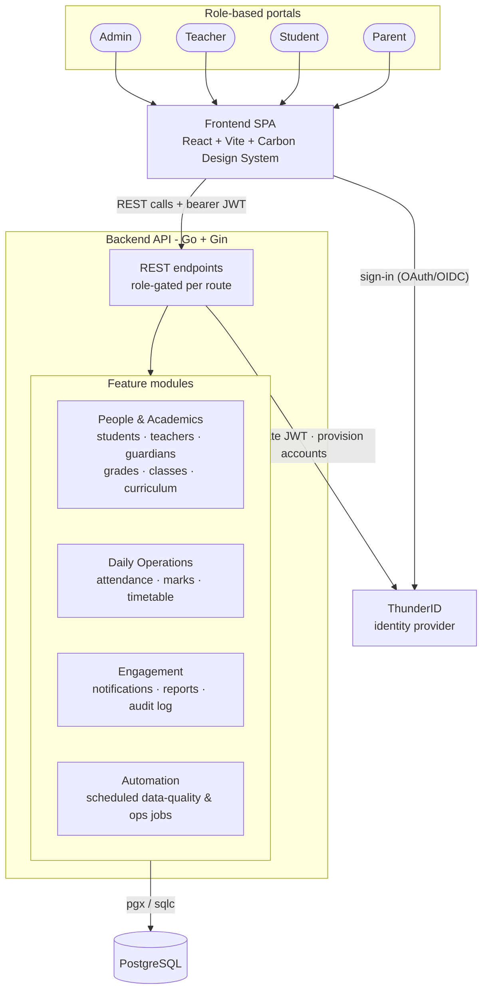

  

<h1 align="center">OpenSchool</h1>

  Digital infrastructure for Sri Lankan government schools.

  
  
  
  

---

## What is this about

OpenSchool is a self-hosted school management system built for the way Sri
Lankan schools actually run - houses, grades, streams, terms, attendance,
guardians, and the admin/teacher/student/parent roles around them. It's a
monorepo with a Go REST API backend and a React (Carbon Design System)
frontend, authenticating through [ThunderID](https://github.com/thunderid).

See [`docs/FEATURES.md`](docs/FEATURES.md) for the full, current feature
list, or [`docs/ARCHITECTURE.md`](docs/ARCHITECTURE.md) for how it's built.

## System at a glance

One Go binary, one Postgres database, one external identity provider - no
queue, cache, or extra services to operate. See
[`docs/ARCHITECTURE.md`](docs/ARCHITECTURE.md) for the full component
breakdown, data model, and layering within the backend.

## Who uses what

There's one sign-in page - which of the four portals below a user lands on
is decided entirely by the `roles` claim on their token, never a separate
URL per role:

```mermaid
flowchart TB
    Start(["Sign in<br/>ThunderID"]) --> Role{"Role on token"}

    Role -->|admin| Admin
    Role -->|teacher| Teacher
    Role -->|student| Student
    Role -->|parent| Parent

    subgraph Admin["🛠️ Admin - runs the school"]
        direction TB
        A1["People<br/>students · teachers · guardians · staff"]
        A2["School setup &amp; curriculum"]
        A3["Grades, classes &amp; timetable"]
        A4["Attendance oversight"]
        A5["Promotion &amp; reports"]
        A6["Automation<br/>scheduled data-quality checks"]
    end

    subgraph Teacher["🍎 Teacher - runs the classroom"]
        direction TB
        T1["My Classes &amp; Subjects"]
        T2["Class Attendance<br/>mark student attendance"]
        T3["Record Marks<br/>My Subjects &amp; Classes overview"]
        T4["My Timetable"]
        T5["My Attendance<br/>own attendance, read-only"]
        T6["My Society /<br/>Review Timetables (Section Head+)"]
    end

    subgraph Student["🎓 Student - tracks their own record"]
        direction TB
        S1["My Profile"]
        S2["My Attendance history"]
        S3["My Term Marks"]
        S4["My Timetable"]
    end

    subgraph Parent["👪 Parent - tracks their children"]
        direction TB
        P1["Linked Children"]
        P2["Child Attendance &amp; Marks"]
        P3["Child Timetable"]
    end

    Admin --> Notif(["Notification Center<br/>every portal"])
    Teacher --> Notif
    Student --> Notif
    Parent --> Notif
```

A parent or student can only ever see their own (or their own child's)
data - enforced server-side, not just hidden in the UI. See
[`docs/FEATURES.md`](docs/FEATURES.md) § Portals at a glance for the full
per-role breakdown, or [`docs/SETUP.md`](docs/SETUP.md) to walk through
every module hands-on.

## Getting started

New to the project? Start here, in order:

1. [`CONTRIBUTING.md`](CONTRIBUTING.md) - set up the full local dev
   environment (Postgres, ThunderID, backend, frontend) from scratch.
2. [`docs/THUNDERID.md`](docs/THUNDERID.md) - one-time identity-provider
   configuration, if you haven't already got a ThunderID instance running.
3. [`docs/SETUP.md`](docs/SETUP.md) - walk through first-run admin
   registration, the school setup wizard, and every module hands-on.

## Documentation

| Doc | What's in it |
| --- | --- |
| [`docs/FEATURES.md`](docs/FEATURES.md) | What OpenSchool does today, module by module |
| [`docs/ARCHITECTURE.md`](docs/ARCHITECTURE.md) | Component layout, layering, data model, external interfaces, non-functional design |
| [`docs/adr/`](docs/adr/) | Architecture Decision Records - the *why* behind non-obvious choices |
| [`docs/SETUP.md`](docs/SETUP.md) | End-to-end operational setup walkthrough |
| [`docs/THUNDERID.md`](docs/THUNDERID.md) | Identity-provider configuration |
| [`docs/plan.md`](docs/plan.md) | Historical, phase-by-phase build log this project grew from |
| [`audit.md`](audit.md) | Standing code-quality and security audit, with severity |
| [`CLAUDE.md`](CLAUDE.md) | Quick architecture reference for AI coding assistants / new contributors |

## Contributing

Contributions are welcome - see [`CONTRIBUTING.md`](CONTRIBUTING.md) for
the local dev setup and PR workflow. Please also read the
[Code of Conduct](CODE_OF_CONDUCT.md) before participating.

## Security

Found a security issue? Please **don't** open a public GitHub issue - see
[`SECURITY.md`](SECURITY.md) for how to report it privately.

## Maintainers

This project is maintained by its open-source contributors - see the
[contributors graph](https://github.com/openschool-org/openschool/graphs/contributors).

## License

[Apache 2.0](LICENSE) - see the [`LICENSE`](LICENSE) file for the full text.
