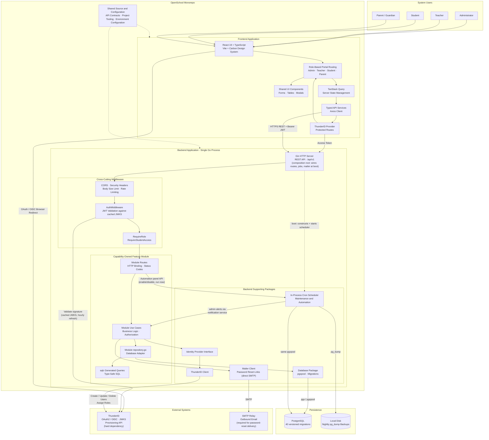
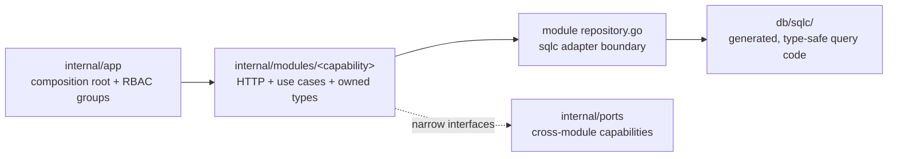
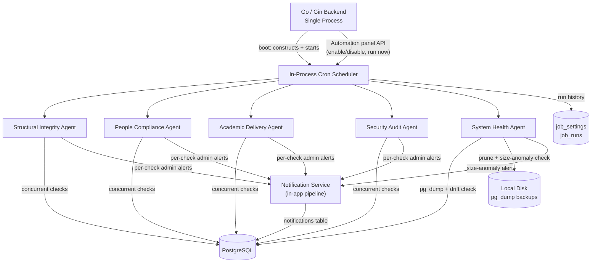

# Architecture

This document describes how OpenSchool is put together: components,
layering, data model, external interfaces, and the non-functional
properties the system is designed around. For *what* the system does,
see [`FEATURES.md`](./FEATURES.md); for *why* specific non-obvious
decisions were made the way they were, see [`adr/`](./adr/).

## 1. System overview

OpenSchool is a single backend binary plus a static frontend build, one
required external identity service, and one optional external mail relay.
There is no server-rendered HTML, no separate job-queue/worker *process*,
and no cache layer (e.g. Redis) in front of the database - every read goes
straight to Postgres. There **is** an in-process, cron-scheduled background
job runner inside the API binary itself (§2.2) - it shares the same
`pgxpool` and lifecycle as the HTTP server, rather than being a separate
deployable.



The mailer and Automation-to-Notifications arrows are drawn in their real
dependency direction: `internal/modules/automation` uses the Notifications
module to raise admin alerts, never the other way around, and the scheduler
itself is constructed and started once, at boot, from the composition
root (`internal/app.Setup`/`main.go`), not called into from request-
handling code. See [§2.2](#22-background-jobs) for the background-jobs
detail view.

See [`adr/0005-hand-rolled-password-reset.md`](./adr/0005-hand-rolled-password-reset.md)
for the one place OpenSchool stores anything resembling a credential
itself, and [§6, "Security"](#6-non-functional-characteristics) below for
what that implies operationally.

## 2. Backend architecture

Go, using the [Gin](https://gin-gonic.com/) HTTP framework and
[pgx](https://github.com/jackc/pgx)/[sqlc](https://sqlc.dev/) for
database access. The backend is a modular monolith: each business capability
owns its HTTP boundary, use cases, persistence adapter, and focused tests.



- **`internal/app/`** - the composition root. `app.go` orchestrates focused
  capability wiring files, which create shared adapters and inject them into
  feature modules through authorization-scoped Gin groups.
- **`internal/modules/`** - capability-oriented vertical slices such as
  School, People, Academics, Attendance, Identity, and Timetable. HTTP
  handlers depend on module use cases; use cases depend on narrow interfaces.
- **Module `repository.go` files** - the only module files allowed to import
  `db/sqlc`. They map generated rows into module-owned types before returning.
- **`internal/ports/`** - narrow contracts for capabilities shared across
  modules, preventing one module from reaching into another module's storage.
- **Module route files** - each capability registers its own endpoints onto
  authorization-scoped groups supplied by `internal/app`; no central route
  compatibility package sits between the composition root and modules.
- **Module model files** - request/response and read-model contracts live with
  the capability that owns them. Generated database rows remain isolated in
  `db/sqlc/models.go`.

Cross-cutting packages:

- **`internal/middleware/`** - `AuthMiddleware` (JWT validation against
  ThunderID's JWKS, RS256, issuer-checked, audience-checked only if
  `THUNDERID_AUDIENCE` is set), `RequireRole`, `RequireStudentAccess`
  (a third authorization primitive - used where the caller must additionally
  own or be linked to the specific student record in the URL, not just hold
  a role), `RateLimit` (per-IP token bucket, applied globally) and the
  separate `PerAccountRateLimit` (per-authenticated-subject token bucket,
  applied only inside the `protected` route group, on top of the per-IP
  one), `BodySizeLimit` (caps every request body at 5 MiB via
  `http.MaxBytesReader`, since Gin applies no cap by default), `SecurityHeaders`.
- **`internal/idp/`** - the provider-neutral seam
  (`Provider` interface: `CreateUser`/`UpdateUser`/`DeleteUser`/`AssignRole`)
  that `internal/thunderid` implements. See
  [`adr/0001-thunderid-as-sole-identity-provider.md`](./adr/0001-thunderid-as-sole-identity-provider.md).
- **`internal/authz/`** - application role constants and token-role
  resolution. This is intentionally separate from both the external IdP seam
  and the `/me` and reconciliation workflows in `internal/modules/identity`.
- **`internal/modules/automation/`** - an in-process, cron-scheduled (`robfig/cron/v3`)
  background job runner, started/stopped alongside the HTTP server from
  `main.go` (`scheduler.Start()`/`defer scheduler.Stop()`) - not a separate
  worker process or external queue. See [§2.2](#22-background-jobs) below.
- **`internal/mailer/`** - sends outbound email (currently only
  password-reset links) via direct SMTP (STARTTLS or implicit TLS,
  TLS 1.2+, 15s send deadline); if `SMTP_HOST` is unset it logs the
  message instead of failing, so local dev needs no mail server - a real
  deployment must configure `SMTP_*` for reset links to actually be
  delivered. See
  [`adr/0005-hand-rolled-password-reset.md`](./adr/0005-hand-rolled-password-reset.md)
  and [§5.3](#53-outbound-mail-smtp).
- **`internal/database/`** - DSN construction, pool setup, and the
  `golang-migrate` runner invoked automatically on startup.
- **`internal/config/`** - `.env` loading via `godotenv`.

**Database access rule:** all SQL lives in `backend/db/queries/*.sql`,
annotated for `sqlc`; running `sqlc generate` regenerates
`backend/db/sqlc/`, which is never hand-edited. Schema is defined
entirely by the versioned migrations in `backend/db/migrations/`
(currently 40), applied automatically on every backend startup.

### 2.2 Background jobs (agents)

`internal/modules/automation` runs read-mostly maintenance/ops checks on their own cron
schedules, inside the same binary and `pgxpool` as the API - no separate
worker, queue, or LLM/AI call anywhere in the path (every check is SQL
plus arithmetic). Each **agent** implements a small `Job` interface
(`Name`/`Schedule`/`Description`/`Run`) and runs its own checks
concurrently (`runChecks`, goroutines + `sync.WaitGroup`, so one failing
check can't hide what the others found). `Scheduler` ticks each agent,
records every run in `job_settings`/`job_runs`, guards against an agent
overlapping itself, and recovers panics. Admins enable/disable and
manually trigger agents from the **Automation** panel; the system-health
agent (backup) is the one exception that can't be disabled.

| Agent | Schedule | Checks |
| --- | --- | --- |
| `structural_integrity_agent` | daily 03:00 | current-academic-year invariant, student gender vs. school type, empty grades/streams, unclassed students |
| `people_compliance_agent` | daily 05:00 | inactive teachers still assigned, zero-guardian students, teacher/student onboarding (severity rises with age) |
| `academic_delivery_agent` | weekdays 12:00 | missing/inconsistent attendance sessions, stale sessions, term-marks deadline and pace-behind-schedule |
| `security_audit_agent` | hourly | per-actor statistical audit-log anomaly detection, off-hours activity, expired reset-token sweep |
| `system_health_agent` | daily 02:00 | nightly `pg_dump`, migration-drift check, backup retention pruning, backup size-anomaly detection |



Each check sends its own titled, categorized notification, so the
frontend's `AgentFindingsBanner` can match on that title and surface a
finding on the correct admin page even though several checks share one
agent. There is no separate alerting channel - see
[`adr/0004-in-app-only-notifications.md`](./adr/0004-in-app-only-notifications.md).

## 3. Frontend architecture

Vite + TypeScript + React 19, using IBM's
[Carbon Design System](https://carbondesignsystem.com/) for components and
[TanStack Query](https://tanstack.com/query) for server-state management.

- **`main.tsx`** - composition root: `ThunderIDProvider` →
  `QueryClientProvider` → `BrowserRouter` → `App`.
- **`App.tsx`** - resolves the signed-in user's role from their JWT
  (`useRole`) and renders one of four route trees (Admin/Teacher/Student/
  Parent), each behind its own layout component and `ProtectedRoute`.
  There is no separate URL namespace per role for the admin portal;
  teacher/student/parent portals use short URL prefixes (`/t/...`,
  `/p/...`) mainly to disambiguate routes that exist in more than one
  portal.
- **`src/pages/`** - one directory per portal (`admin/`, `teacher/`,
  `student/`, `parent/`, `notifications/` shared across portals); admin
  pages are further split by module, mirroring the backend's module list.
- **`src/services/`** - one file per backend module, wrapping `axios`
  calls with typed request/response shapes matching the backend's
  module-owned API contracts.
- **`src/queries/`** - TanStack Query hooks built on `src/services/`; every
  query key is a named, typed builder function (e.g. `studentKey(id)`),
  and mutations invalidate the specific keys they affect. This layer is
  the most consistently well-executed part of the frontend - see
  `audit.md`'s frontend architectural notes.
- **`src/hooks/`** - cross-cutting hooks (`useRole`, `useApi` - the axios
  interceptor wiring the ThunderID access token onto every request,
  `useProvisionUser`, `usePagination`).
- **`src/components/common/`** - the shared CRUD-page building blocks
  (`ConfirmDeleteModal`, `EntityCombobox`, `EmptyState`, `TableSkeleton`,
  etc.) that essentially every admin page composes from, giving the ~40
  admin pages a consistent list → modal-form → confirm-delete shape.

**Convention:** almost every admin CRUD page follows the same template -
list with search/filter, a `ComposedModal` for create/edit, a shared
`ConfirmDeleteModal` for delete, and the same three loading/empty/error
states. Deviating from this template without a reason is a signal
something's off, not a style choice.

## 4. Data model

Schema is defined across 40 versioned migrations
(`backend/db/migrations/`). Grouped by area:

| Area | Tables |
| --- | --- |
| Identity & accounts | `users`, `password_reset_tokens` |
| School & academic structure | `school`, `academic_years`, `houses`, `grades`, `classes`, `streams`, `stream_groups`, `mediums` |
| Curriculum | `subjects`, `mediums`, `levels`, `selection_groups`, `group_subjects` |
| People | `student_profiles`, `student_siblings`, `student_guardians`, `guardians`, `teacher_profiles`, `teacher_subjects`, `non_academic_staff`, `prefects`, `section_heads`, `teacher_positions`, `vice_principal_grade_scopes` |
| Enrollment | `class_students`, `class_subject_teachers`, `student_subject_enrollments`, `student_subject_selections`, `student_enrollment_locks` |
| Attendance | `attendance_sessions`, `attendance_records`, `staff_attendance_records` |
| Academic records | `terms`, `term_marks`, `student_progress_reports`, `student_activities`, `student_leadership_roles`, `student_awards`, `student_disciplinary_records` |
| Extracurricular | `societies`, `society_members` |
| Timetable | `timetable_settings`, `grade_sections`, `grade_section_grades`, `classrooms`, `subject_period_requirements`, `teacher_availability`, `timetables`, `timetable_periods`, `timetable_entries`, `timetable_status_history`, `timetable_notifications` |
| Notifications | `notifications`, `notification_recipients` |
| Automation | `job_settings`, `job_runs` |
| Audit | `audit_logs` |

### Key relationships

- **`users`** anchors every login-capable account, 1:1 with
  `teacher_profiles` / `student_profiles` / a login-enabled `guardians`
  row.
- **`academic_years`** is the temporal scope almost everything else reads
  through its `is_current` flag - see
  [`adr/0003-single-current-academic-year.md`](./adr/0003-single-current-academic-year.md).
- **`classes`** belongs to a `grade` + `academic_year`, optionally a
  `stream`/`stream_group` (Advanced Level) and a `medium`; `class_students`
  is the per-year many-to-many enrollment junction;
  `class_subject_teachers` is the per-class, per-subject teacher
  assignment - the authoritative source timetable auto-generation and
  marks-entry authorization both read; assigning a row requires the
  teacher already hold that subject in `teacher_subjects` (the global
  qualification list, managed from the Teacher Subjects admin page).
- **`student_guardians`** is the many-to-many junction supporting shared
  guardians across siblings.
- **`teacher_positions`** + `vice_principal_grade_scopes` implement the
  Principal/Vice Principal layer; see
  [`adr/0002-in-app-position-layer.md`](./adr/0002-in-app-position-layer.md).
- **`timetables`** owns `timetable_entries` (per-period assignments) and
  `timetable_status_history` (the transition audit trail);
  `timetable_periods` belongs to a `grade_section`, not an individual
  timetable, since a period grid is shared by every class in that section.
- **`audit_logs`** is a generic, entity-agnostic append-only log
  (`entity_type` + `entity_id` + `action` + before/after JSON), not a
  per-table audit trail.

For exact columns, types, and constraints,
`backend/db/sqlc/models.go` (generated from the migrations) is the
authoritative reference - this table is a navigational summary, not a
schema dump.

## 5. External interfaces

### 5.1 ThunderID (identity provider)

Two integration points, both configured via `THUNDERID_*` environment
variables (see [`THUNDERID.md`](./THUNDERID.md)):

1. **Token validation** - every authenticated request's JWT is validated
   (RS256, issuer-checked) against a JWKS key set fetched from ThunderID
   and cached in-process (`MicahParks/keyfunc`, `internal/middleware/auth.go`).
2. **Provisioning API** - account create/update/delete and role
   assignment, via `internal/thunderid.Client`, behind the
   `internal/idp.Provider` interface.

OpenSchool never stores a primary login password; see
[`adr/0001-thunderid-as-sole-identity-provider.md`](./adr/0001-thunderid-as-sole-identity-provider.md).

```mermaid
sequenceDiagram
    actor User
    participant React as React Frontend
    participant T as ThunderID
    participant API as Go Gin Backend
    participant DB as PostgreSQL

    User->>React: Click Login
    React->>T: Start OAuth / OIDC login (browser redirect)
    T-->>User: Login page
    User->>T: Enter credentials
    T-->>React: Authentication result / tokens

    React->>API: HTTPS request + Bearer JWT
    API->>API: Validate JWT signature against<br/>cached JWKS key set
    Note over API,T: Keys are fetched from ThunderID once and cached;<br/>refreshed automatically every hour (default), or immediately<br/>if a request presents an unrecognized key id (rate-limited<br/>to once per 5 min) - most requests validate locally and<br/>do NOT round-trip to ThunderID.
    API->>API: Check roles and permissions<br/>(RequireRole / RequireStudentAccess)
    API->>DB: Query application data
    DB-->>API: Return data
    API-->>React: JSON response
    React-->>User: Display result
```

### 5.2 REST API

JSON over HTTP under `/api/v1`. Authenticated via `Authorization: Bearer
<JWT>` on every route except `/health`, the one-time `/setup/admin`, and
the unauthenticated password-reset identify/reset endpoints.

Swagger docs are available at `http://localhost:8080/swagger/index.html#/`
in development builds only (`APP_ENV=development`), not exposed in
production. It's a committed snapshot, not regenerated from source
annotations - handlers now carry one plain comment line instead of
`swaggo` tags.

### 5.3 Outbound mail (SMTP)

`internal/mailer` sends the one email OpenSchool generates itself: the
self-service password-reset link (`adr/0005`), triggered from
`auth.Service.ForgotPassword` and rendered end-to-end by the frontend's
`ForgotPassword.tsx`/`ResetPassword.tsx` pages. It speaks SMTP directly
(Go's standard library `net/smtp`, no third-party mail API/SDK) and
supports both submission-port STARTTLS (587/25, upgrading the connection
only if the server advertises the extension) and implicit-TLS SMTPS
(465), each pinned to TLS 1.2+; the whole exchange (dial through `QUIT`)
is bounded by a 15-second deadline so an unreachable or slow mail host
fails the request instead of hanging it. Configured via `SMTP_HOST`,
`SMTP_PORT`, `SMTP_USERNAME`, `SMTP_PASSWORD`, `SMTP_FROM`.

**This still requires a deployment to supply real SMTP credentials** -
same as it requires real database credentials. If `SMTP_HOST` is left
unset, `internal/mailer.NewFromEnv` deliberately falls back to logging the
message to the server console instead of sending it (so local dev needs no
mail server), which also means **a deployment that never configures SMTP
has no working self-service password reset** - only a server-log record
of what would have been sent. This is an operational/configuration
prerequisite, not a code gap; there is otherwise no other outbound
notification channel - see
[`adr/0004-in-app-only-notifications.md`](./adr/0004-in-app-only-notifications.md).

## 6. Non-functional characteristics

### Security

- All primary-flow authentication/password storage is delegated to
  ThunderID.
- Self-service password-reset tokens (the one credential-like thing
  OpenSchool stores itself) are hashed (SHA-256), single-use, and expire
  in 15 minutes. Token consumption is an atomic conditional update, so one
  reset link cannot be claimed by concurrent requests - see `adr/0005`.
- `X-Content-Type-Options: nosniff`, `X-Frame-Options: DENY`, and
  `Referrer-Policy: same-origin` are set on every response; no CSP, since
  this is a JSON-only API that never serves HTML.
- CORS origins are an explicit allow-list, not a wildcard.
- The server does not trust `X-Forwarded-For` from arbitrary clients (no
  proxies trusted by default), so per-IP rate limiting can't be trivially
  spoofed by a client-supplied header.
- Every request is rate-limited per client IP (default 30 req/s, burst
  60), independent of any endpoint-specific stricter limit (e.g. the
  admin-registration and password-reset endpoints). Every authenticated
  request is *also* rate-limited per account (`PerAccountRateLimit`, same
  defaults, separately tunable) inside the `protected` group, so one
  compromised/misbehaving account can't be masked by a shared-IP allowance.
- Every request body is capped at 5 MiB (`BodySizeLimit`, via
  `http.MaxBytesReader`) - Gin applies no cap by default, so without this a
  client could POST an unbounded body regardless of client-side checks.
- JWT validation happens against ThunderID's live JWKS endpoint (RS256,
  issuer-checked always, audience-checked only if `THUNDERID_AUDIENCE` is
  set). The JWKS HTTP client strips `x5c` certificate chains from the
  response before parsing. In `APP_ENV=development` only, that same client
  skips TLS certificate verification against the JWKS endpoint, to allow a
  self-signed local ThunderID instance - this must not be the value in a
  production `APP_ENV`.
- `RequireStudentAccess` is a third authorization primitive beyond plain
  role checks, used where a route must additionally confirm the caller
  owns or is linked to the specific student in the URL (not just holds a
  role) - the same narrow authorization pattern applied inside module use
  cases elsewhere.

See [`audit.md`](../audit.md) for known gaps against the above as of its
last update.

### Availability & reliability

- Migrations run automatically and idempotently on backend startup; the
  process fails fast (refuses to start serving traffic) if migrations
  fail.
- HTTP read/write timeouts (15s) and idle timeout (60s) bound resource
  usage per connection.
- A nightly `pg_dump` (`internal/modules/automation.SystemHealthAgent`, default 02:00,
  writes to local disk under `JOB_BACKUP_DIR`, retains the newest 14
  dumps) is the only backup mechanism - there is no managed database
  failover for this single-instance, self-hosted deployment. The same
  agent checks the DB's applied migration version against what the
  running binary expects, reports drift, and flags a dump whose size is
  anomalously small compared to recent backups.
- Background jobs recover from panics and record every run's
  start/finish/status in `job_runs`, so a single failing or wedged job is
  visible (via the Automation panel) rather than silently stuck or taking
  the process down; each run is bounded by a 5-minute timeout.

### Performance

- Rate-limit defaults are deliberately generous: school users are
  frequently behind one shared IP/NAT, so a tight per-IP limit would
  throttle an entire school rather than an individual abusive client.
  Tunable via environment variables without a code change.
- Bulk operations that touch many rows at once (e.g. promotion commit) use
  batched, set-based SQL writes rather than per-row loops where this
  pattern has been applied - not yet applied uniformly everywhere a
  per-row loop exists today (tracked in `audit.md`).
- No load testing has been performed against a realistic full-school
  concurrent-usage pattern (e.g. a morning attendance-marking rush); rate
  limit and DB pool defaults are provisional pending that.

### Maintainability

- Consistent layered architecture (routes → handlers → services →
  repositories) across all ~30 backend feature modules.
- Generated code (`db/sqlc/`, Swagger docs) is never hand-edited - always
  regenerated from its source of truth.
- One consistent CRUD-page template across the frontend admin portal's
  ~40 pages.

## 7. Constraints and assumptions

- **Single school, single current academic year per deployment** - see
  [`adr/0003-single-current-academic-year.md`](./adr/0003-single-current-academic-year.md).
  Not multi-tenant.
- **A running ThunderID instance is a hard dependency** - there is no
  degraded/offline authentication mode.
- **In-app notifications only** - the notification feature (attendance,
  timetable, announcements, job findings) has no email/SMS/push delivery
  channel; see [`adr/0004-in-app-only-notifications.md`](./adr/0004-in-app-only-notifications.md).
  The one unrelated exception is the password-reset link, which is
  necessarily emailed out-of-band since the recipient can't be signed in
  to see an in-app notification (§5.3).
- **NIC numbers** are validated loosely (required, non-empty) rather than
  by strict format, since valid Sri Lankan NICs come in both a 9-digit+
  letter and a 12-digit-numeric form.
- **No reverse proxy is assumed in front of the backend by default** -
  deploying behind one requires reconfiguring `SetTrustedProxies`.

## 8. Actors

| Actor | System access |
| --- | --- |
| **Administrator** | Full system access - the only role that can configure school structure, run promotion, publish timetables, and view the audit log/analytics |
| **Principal / Vice Principal** | `teacher`-role account with an elevated in-app position - broad or whole-school notification reach |
| **Section Head / Class Teacher / Subject Teacher** | `teacher`-role account with a narrower in-app position - attendance, timetable build/review, and notifications scoped to their assignment |
| **Teacher (no position)** | Attendance marking, own classes/timetable, scoped notifications |
| **Student** | View-only: own profile, attendance, marks, timetable |
| **Parent/Guardian** | View-only: linked children's attendance, marks, timetable |

Server-side authorization is authoritative for every actor above - see
`internal/middleware.RequireRole` and each service's own assignment
checks; frontend restrictions are a convenience layer, not a security
boundary (and `audit.md` tracks the places where a server-side check is
currently missing or incomplete).
