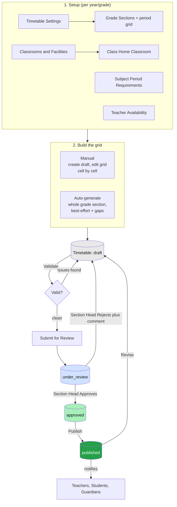
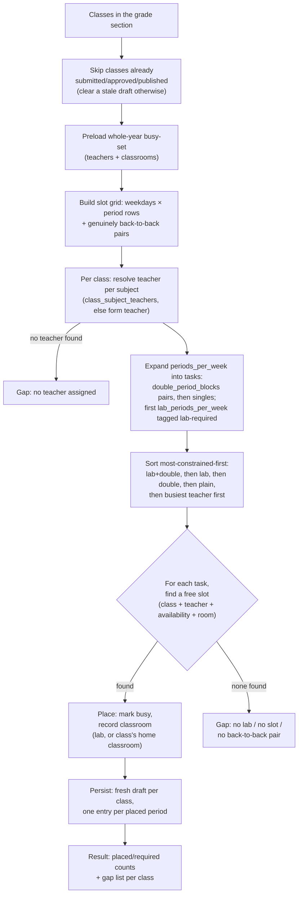

# OpenSchool - Feature Guide

This is the current, as-built feature list - what exists in the codebase today,
organized by module. For the history of how it got here (phased roadmap,
decisions, and rationale), see [`plan.md`](./plan.md). For how to stand up an
instance and walk through these features hands-on, see [`SETUP.md`](./SETUP.md).

Every feature below is scoped by **academic year**: almost all academic data
(classes, enrollments, attendance, marks, timetables, section heads, prefects)
carries an `academic_year_id` and is filtered by the single `academic_years`
row with `is_current = true`. There is no separate "draft year" concept -
promotion and class-shuffle write into a not-yet-current year, which stays
fully editable until an admin flips it current.

---

## Roles & positions

Authentication and the four base roles come from **ThunderID**, the external
identity provider (see [`THUNDERID.md`](./THUNDERID.md)). Every user has
exactly one base role, carried in the `roles` claim of their JWT:

| Role | Identity source |
| --- | --- |
| `admin` | Registered once via the `/setup` wizard on a fresh instance |
| `teacher` | Created from the admin's **Teachers** page |
| `student` | Created from the admin's **Students** page |
| `parent` | Provisioned from a student's **Guardians** tab ("Set Up Login") |

On top of the base `teacher` role, an **in-app position layer** (not backed
by ThunderID - see the rationale in `plan.md` §"Role-hierarchy decision")
adds a hierarchy used for notification reach and dashboard framing:

`Principal → Vice Principal → Section Head → Class Teacher → Subject Teacher → Teacher`

- **Principal / Vice Principal** - permanent appointments (`teacher_positions`
  table), not renewed per academic year. At most one Principal exists at a
  time. A Vice Principal is scoped to specific grades (`vice_principal_grade_scopes`)
  or, if granted, the whole school.
- **Section Head** - a year-scoped teacher-in-charge (TIC) of a grade or
  grade+stream (`section_heads`), reviews and approves/rejects timetables for
  their grade(s).
- **Class Teacher** - the form teacher of a specific class (`classes.form_teacher_id`),
  year-scoped.
- **Subject Teacher** - a teacher assigned to teach a subject in a class
  (`class_subject_teachers`), year-scoped. Assigning one (from a class's
  "Subjects & Teachers" tab) requires the teacher already hold that subject
  as a qualification on the **Teacher Subjects** page (`teacher_subjects`,
  the single place qualifications are declared) - the teacher picker there
  is scoped to qualified teachers only, and the backend rejects an
  unqualified assignment even if attempted directly. Each row also shows
  whether the pairing is actually covered by the class's currently
  published timetable.

Rank determines two things in the UI: how much of the school a teacher can
target when sending a notification (§ Notifications), and what their own
dashboard shows them (a `RoleBadge` and, for Section Head and above, a
"Leadership" panel).

---

## Identity, accounts & password lifecycle

- **Account provisioning** - teacher, student, and parent accounts are all
  created from inside OpenSchool (Teachers page, Students page, a student's
  Guardians tab), which provisions the matching ThunderID account
  automatically. There is no self-registration for any role.
- **NIC/index-number default passwords** - new accounts don't get a
  manually-typed password. A teacher's or guardian's initial password is
  their NIC number (`nic_number`, required and unique per person); a
  student's is their `index_number`. Admins are the one exception - they set
  their own password during the one-time `/setup` flow.
- **Forced first-login password change** - any account created with a
  default password is flagged `must_change_password`. On next sign-in the
  user is routed to a full-page interstitial before they can reach anything
  else, with the choice to keep the default password or set a new one.
- **Self-service password reset** - "Forgot password?" on the sign-in page
  identifies the user by login email plus their on-file secret (NIC for
  teacher/parent, index number for student - admins are excluded, since they
  have no secondary secret on file), then emails a short-lived, single-use
  reset link (15 minutes, token stored only as a hash) via SMTP. Requires
  `SMTP_*` env vars set - without them, the link is only logged server-side,
  not actually delivered. A signed-in user can also change their password at
  any time from the header menu.
- **Orphaned-identity handling** - if provisioning a ThunderID account
  succeeds but the local Postgres write fails (or vice versa), a
  compensating rollback attempts to delete the partially-created side. This
  is best-effort today (see `audit.md` for the known gap and a proposed
  reconciliation job).

## School setup & academic structure

- **First-run School Setup wizard** (`/school-setup`) - a guided,
  resumable, idempotent flow: School details → Houses → Grades → Classes →
  Mediums → Done. Blocks access to the rest of the app until the school
  record and grade range exist. See `SETUP.md` §3 for the full walkthrough.
- **School profile** - name, address, phone, email, an inline-stored logo,
  the grade range the school runs (1–13), and a school type (boys / girls /
  mixed), editable afterward from Settings. A single-sex school type is
  enforced against `student_profiles.gender` at student create/update time -
  gender stays optional under `mixed`, but must be set and match under
  `boys`/`girls`.
- **Academic years** - create/list years, and flip exactly one to "current"
  (`SetCurrentAcademicYear`), which is what almost every other module reads
  as its implicit scope.
- **Houses** - named groups (with an editable color) that students and staff
  are auto-assigned into using a least-populated-house-with-random-tiebreak
  balancing query, so houses self-balance without admin-maintained
  configuration. Manual reassignment is available and audit-logged.
- **Grades, classes, streams** - grades are the 1–13 school-year structure;
  regular grades get lettered class sections (10-A, 10-B, …); Grade 12/13
  (Advanced Level) instead offer **streams** (Physical Science, Bio Science,
  Commerce, Arts, Technology) with editable short codes and their own
  section counts (12-M1, 12-M2, 13-C1, …). Streams that need finer grouping
  (e.g. splitting Science into Physical/Bio) use **stream groups**.
- **Mediums** - Sinhala/Tamil/English (or custom) languages of instruction.
  A class can optionally be pinned to a medium (`classes.medium_id`); a
  medium-pinned class is excluded from the promotion module's "distribute by
  marks / randomly" auto-fill pools so it's never partially refilled with
  students who don't belong to that medium, and its students carry straight
  over to the same-medium class in the next grade.

## Curriculum

- **Subjects** - the subject catalogue (name, code).
- **Curriculum levels & selection groups** - per-grade curriculum
  definitions; **subject buckets** group optional/elective subjects a
  student picks from (e.g. "choose 3 of these 6"), enforced at enrollment
  time via `student_subject_selections`.
- **Subject enrollment** - per-student, per-subject enrollment records
  (`student_subject_enrollments`), used to scope who's eligible for a given
  subject's marks, timetable periods, and subject-teacher notifications.

## People

- **Students** - profile, enrollment status (active/left), house, guardians
  (up to 2 per student, shared guardians supported for siblings), and an
  8-tab detail view: Profile, Guardians, Subject Enrollment, Progress
  Reports, Activities, Leadership & Awards, Disciplinary, and a read-only
  Records rollup (attendance history, exam results, prefect appointments).
- **Teachers** - profile (title, gender, NIC, employee number - auto-assigned
  from a shared sequence with non-academic staff), employment status
  (active/resigned/transferred), house, and position (§ Roles & positions).
- **Guardians directory** - a searchable, dedicated directory (not just
  inline on a student page) with notification history and portal-login
  status per guardian; delete is blocked while a guardian is still linked to
  any student, since unlinking silently from every child would be
  surprising.
- **Non-academic staff** - Lab Assistant, Librarian, Office Staff,
  Development Officer, IT Officer, Security, Minor Employee - profiles with
  no login/IDP account (no `user_id`), sharing the employee-number sequence
  with teachers.
- **Prefect board** - rank-based appointments (Head Prefect down to House
  Captain / Vice House Captain) per academic year, with a year selector that
  switches past years into a read-only archive view.
- **Societies** - clubs/societies (Science Society, Interact/Leo Club,
  Scouts, etc.), each with an admin-assigned Teacher-in-Charge and a
  five-role student roster (Leader, Deputy Leader, Secretary, Treasurer,
  Member) per academic year, with the same year-selector archive view as the
  prefect board. The Teacher-in-Charge manages their own society's roster
  from a "My Society" page in the teacher portal; admins can manage any
  society. Distinct from the free-text `student_activities` "society"
  category - memberships here are FK-linked to a real society record and
  surface in the student's Activities tab alongside it.
- **Positions** - the Principal/Vice Principal admin screen (§ Roles &
  positions).

## Attendance

- **Student attendance** - per-class daily sessions with per-student
  present/absent/late/excused records. Sessions lock 24 hours after
  creation; admins can override a lock, and any post-lock edit/delete is
  recorded in the audit log. A newly-marked `absent` record triggers an
  in-app notification to that student's guardians.
- **Staff attendance** - one record per staff member per day
  (present/late/absent/leave - a separate status set from student
  attendance), covering both teachers and non-academic staff, with a
  monthly summary view. Marked by an admin only; a teacher sees their own
  record read-only from a dedicated **"My Attendance"** page in the teacher
  portal (`/me/teacher/attendance`, scoped to the caller's own profile -
  distinct from "Class Attendance", which is where a teacher marks *their
  students'* attendance).

## Academic records

- **Terms** - the school's term/semester structure per academic year, with
  one `is_current` term at a time (same single-current pattern as academic
  years).
- **Term marks** - per-subject marks per student per term, with an aggregate
  ranking query used by promotion (§ below). A student can be marked
  **absent ("AB")** for a subject/term instead of a numeric score
  (`is_absent`); absent entries are excluded from dashboard averages and
  the promotion ranking total so an absence never counts as a zero.
- **Teacher marks entry** (`/t/marks`) - a "My Subjects & Classes" overview
  grouped by subject, with each class shown as a card carrying a live
  marks-entered count (e.g. "18/30 entered") for the selected term.
  Clicking a card opens the entry grid with the current term pre-selected
  (`terms.is_current`, no manual pick needed for the common case). A term
  selector at the top doubles as the way to review or enter marks for a
  past term - the same overview and grid work for any term, not just the
  current one.
- **Student portfolio** - progress reports (term-scoped narrative),
  activities (clubs/sports/societies/competitions in one consolidated
  table), leadership roles, awards, and disciplinary records - each a
  simple CRUD tab on the student detail page.

## Promotion & class reassignment

A preview-then-commit flow, run once per source→target academic year pair:

1. **Preview** computes each actively-enrolled student's next grade (by
   grade sort order) and a non-binding same-name class-carryover suggestion
   (or same-*medium* suggestion for medium-pinned classes). Students at the
   top grade are flagged `graduating`, not silently dropped.
2. The admin reviews a per-grade table of proposed assignments, freely
   overriding any individual student's target class, or using one of two
   bulk-assist buttons per grade group: **Distribute by marks** (sorts by
   total term marks, deals students round-robin across target classes for
   an even high-to-low spread) or **Assign randomly** (same round-robin
   dealing over a shuffled order). Both keep every class within one student
   of equal size and leave every assignment individually overridable.
   Medium-pinned students are excluded from both auto-fill pools.
3. **Commit** bulk-writes the final per-student class assignments for the
   target year in one batched operation. Nothing is visible to the rest of
   the app until an admin separately flips the target year to "current."

## Timetable

Modeled on how a real Sri Lankan school actually runs: **students stay in
one fixed homeroom all day** - they never move between periods - and
**teachers rotate in** to teach each subject. Two exceptions to the fixed
homeroom: a subject can require some of its weekly periods to happen in a
special-purpose **Lab** (tagged to exactly one subject, e.g. a Science Lab)
or an **ECA** facility (Library, Music Room, Auditorium, etc., not tied to
any subject); and a subject can run some of its weekly periods as a
**double period** - two back-to-back periods of the same subject/teacher/
room in one sitting, common for AL (Grade 12/13) subjects - without that
being all-or-nothing (a subject can have, say, 6 periods/week with only 1
or 2 of those doubled and the rest single).

A class's timetable moves through a config → build → validate → review →
publish pipeline. Building the grid can be done by hand or auto-generated;
everything downstream of that (validate/submit/review/publish) is identical
either way.

### 1. Setup (once per academic year / grade - independent of any one class)

| # | What | Where | Notes |
|---|------|-------|-------|
| 1 | **Timetable Settings** | `/timetable-settings` | The school's default daily schedule template (start/end time, period count, period/interval duration) for the current academic year - used only to auto-generate a *starting* period grid, never read directly when scheduling. |
| 2 | **Grade Sections** | `/timetable-settings` (Grade Interval Times tab) / `/grade-sections` | Named groups of grades that share one period grid and one Section Head reviewer (e.g. Primary, Junior Secondary, Senior Secondary, A/L). A section's grid (`timetable_periods`) can be regenerated from Timetable Settings and hand-edited afterward - rows are either a `period` (with a `period_number`) or an `interval`/break, ordered by `sort_order`. The day dimension isn't in the grid at all; it lives on each timetable entry (`day_of_week` 1–5, Mon–Fri). |
| 3 | **Classrooms & Facilities** | `/classrooms` | Every physical room. `room_type` is `regular` (a class's homeroom), `lab` (tagged to exactly one `subject_id` - the auto-generator only ever sends a subject's lab periods to a lab tagged to *that* subject), or `eca` (not subject-tied). School Setup's optional "Rooms & Facilities" step can bulk-create common presets (Library, Music Room, IT Room, Science Lab, Auditorium) as `eca` rooms at setup time - subjects don't exist yet at that point, so a preset like "IT Room" is re-typed into a proper subject-tagged Lab later, once Subjects are set up. |
| 4 | **Class → Home Classroom** | `/classes` (Add/Edit Class) | Each `Class` (e.g. "10-A") can point at one `regular` classroom as its fixed homeroom (`classes.home_classroom_id`) - this is what "students don't move" means concretely. Adding a class auto-suggests a `regular` classroom whose name exactly matches the class name (the common convention - class "13-M1" sits in room "13-M1"); if none exists, one is created automatically on save. An admin can still pick a different room or a different existing one at any time. |
| 5 | **Subject Period Requirements** | `/subject-requirements` | Per grade, per subject: `periods_per_week`, how many of those must be in a matching Lab (`lab_periods_per_week`), and how many should run as double-period blocks (`double_period_blocks` - a *count of 2-period pairs*, capped at `⌊periods_per_week / 2⌋`, not a flag). Validated against before a timetable can be submitted for review. |
| 6 | **Teacher Availability** | per-teacher | Which day/period slots a teacher is unavailable (`teacher_availability`) - absence of a row means available. Checked both by the manual editor's Validate action and by the auto-generator. |

### 2. Building the grid - manual or auto-generated

**Manual** - `/timetables`: create a draft for a class (or copy an existing
timetable as a template, or start a **Revise** from a published one), then
hand-edit the period × day grid, assigning subject/teacher/classroom to
each cell one at a time.

**Auto-generate** - `/timetables/generate`: one click best-effort fills (or
replaces) DRAFT timetables for **every class in a grade section at once**.
Scoped to a whole section, not one class, because teachers and Lab/ECA
rooms are *shared* across a section's classes - generating them in
isolation couldn't avoid double-booking a shared resource. It:

1. Skips any class that already has a submitted/approved/published
   timetable this year (reported, untouched); clears a stale draft first if
   one exists, so re-running is idempotent.
2. Builds one shared candidate slot grid from the section's period rows ×
   weekdays, plus the set of genuinely back-to-back period pairs (adjacent
   in the grid with no interval between them - what a double period is
   allowed to use).
3. For every class, resolves each required subject's teacher from
   `class_subject_teachers`, falling back to the class's form teacher if no
   explicit assignment exists (same bypass the manual Validate action
   grants a form teacher) - a subject with neither is reported as a gap.
4. Expands each subject's `periods_per_week` into placement tasks:
   `double_period_blocks` back-to-back pairs first, then the remaining
   periods as singles; the first `lab_periods_per_week` periods in that
   sequence are tagged lab-required.
5. Places tasks most-constrained-first (lab-requiring and double-period
   tasks before plain ones, then busier teachers before lighter ones),
   searching a deterministically-shuffled slot list per class+subject
   (preferring a day that subject hasn't used yet, to spread it across the
   week) - checking the class, the teacher (busy-set *and* availability),
   and the classroom (a matching Lab, or the class's home classroom) are
   all free. A placed regular period's classroom is set to the class's home
   classroom too, not left blank, so double-booking checks stay meaningful
   for homerooms as well as labs.
6. Anything it can't place - no teacher, no free slot, no matching lab, no
   back-to-back pair available - is left as a **gap** with a specific
   reason, not silently dropped or hard-failed; the resulting draft is a
   perfectly normal one an admin finishes by hand in the manual editor.

### 3. Validate → Submit → Review → Publish (identical for both build paths)

- **Validate** - checks teacher double-booking and classroom double-booking
  across every other timetable in the academic year, teacher-marked
  unavailability, the entry's teacher actually being the class's assigned
  subject teacher (or its form teacher), and unmet weekly period counts
  against Subject Period Requirements.
- **Submit for Review** - only once Validate is clean; notifies the grade's
  Section Head/TIC.
- **Approve / Reject** - by an authorized reviewer (a Section Head for a
  grade they head, via `section_heads`/`grade_sections`), with a required
  comment on rejection.
- **Publish** - archives the previous published version for that class/
  year, notifies every affected teacher/student/guardian.
- **Revise** - clones a published timetable into a new chained draft
  (`parent_timetable_id`) without losing the published version's history.

Every status transition is recorded in `timetable_status_history` and fires
an in-app notification.

### 4. Who sees what

- **Section Head** - a "Review Timetables" nav item and a dashboard panel
  to approve/reject, scoped to the grades they head; hidden entirely for
  Class/Subject Teachers, whose review queue would always be empty.
- **Principal / Vice Principal** - a read-only "All Timetables" view
  (`/t/all-timetables`) and Analytics, school-wide - they monitor, they
  don't build or approve (see [Roles & positions](#roles--positions)
  above).
- **Class/Subject Teacher** - "My Timetable" (their own weekly schedule
  across every class they teach) and "My Classes".
- **Students / Guardians** - the published timetable for their own class /
  their child's class.

### Flow

Auto-generate's internal placement logic, per grade section:

## Notifications

- **In-app only** - no email/SMS/WhatsApp channel.
- **Composer** - shared by admins (`/notifications`) and teachers
  (`/t/notifications`); what a sender is allowed to target is enforced
  server-side by role/position, not just hidden in the UI. Title, message,
  a category (General/Academic/Examination/Attendance/Timetable/Events/
  Sports/Meetings/Fee Reminder/Emergency/Discipline/Holidays), and a
  priority (Normal/Important/Urgent).
- **Recipient rules** (combinable) - Everyone (admin only), By Grade, By
  Class, By Grade Section, By Subject (teachers of it, or students taking
  it), or a specific Student/Guardian/Teacher.
- **Send now or save as draft** - drafts are editable and can be sent later
  by hand; there is no scheduled-send yet.
- **Notification Center** - every signed-in user (any role) has one, with
  Unread/Read/Archived tabs, text search, and a category filter.

## Reports & analytics

- **PDF report export** (admin-only) - two fixed templates, Attendance (by
  class + date range) and Marks (by class + term + subject), each with an
  optional column subset, rendered server-side and streamed as a PDF
  download.
- **Analytics dashboard** - one aggregate endpoint composing student counts
  (by grade/class/gender/house), a 14-day attendance trend, staff counts and
  this-month attendance, subject/examination/grade-wise performance,
  student/staff growth by year, notifications-sent count, and timetable
  completion percentage - rendered as stat tiles and lightweight bar/
  sparkline charts (no charting library dependency).

## Audit log

Every house reassignment, attendance-lock override, and other sensitive
change is recorded with actor, before/after state, and an optional reason,
readable admin-only at `/settings` → Audit Log.

## Automation

Five background agents (`internal/modules/automation`) run scheduled checks that keep
the school's data healthy - no user-facing feature depends on them, so any
can be disabled from `/automation` (admin-only) except System Health.
Every check is plain SQL and arithmetic (no AI/LLM, no external service),
runs on its own cron schedule via an in-process scheduler, and notifies
admins with a severity (`normal`/`important`/`urgent`) when something
needs attention. Each agent runs its own checks concurrently, so a
five-check agent takes about as long as its slowest check, not the sum.

| Agent | Schedule | What it checks |
| --- | --- | --- |
| **Structural Integrity** | daily 03:00 | Current-academic-year invariant, student gender vs. school type, empty grades/streams, unclassed students |
| **People Compliance** | daily 05:00 | Inactive teachers still assigned, students with no guardian, teacher/student accounts stuck onboarding (severity rises with age) |
| **Academic Delivery** | weekdays 12:00 | Missing or inconsistent attendance sessions, stale incomplete sessions, term-marks deadline and pace-behind-schedule |
| **Security Audit** | hourly | Statistical audit-log anomaly detection (per-actor baseline, not one fixed number), off-hours activity, expired password-reset-token sweep |
| **System Health** | daily 02:00 | Nightly `pg_dump`, migration-drift check, backup retention pruning, backup size-anomaly detection - the one agent that **cannot be disabled** |

Findings go out as in-app notifications to every admin. Where a finding is
relevant to a specific admin page (e.g. no-guardian students on the
Students page), a small dismissible banner shows it right there - it
clears once the notification is read, independent of the agent's own
enabled/disabled state.

## Portals at a glance

There is one sign-in page; which portal a user lands on is decided entirely
by the `roles` claim on their token (never a separate URL per role):

| Role | Landing experience |
| --- | --- |
| **Admin** | Full dashboard: everything above |
| **Teacher** | Own dashboard (today's classes, recent sessions, quick actions, rank badge), classes, attendance marking, My Timetable, Review Timetables (if Section Head+), Notifications scoped to their own classes/grades/subjects |
| **Student** | Own profile, attendance history, term marks, timetable (once published), Notification Center |
| **Parent** | List of linked children; per child, attendance/marks/timetable; own Notification Center |

A parent or student can only ever see their own (or their own child's) data
- enforced server-side.

---

## Cross-cutting / non-functional

- **RBAC** - Gin route groups gated by `RequireRole`, checked against the
  JWT's `roles` claim; teacher-side actions are further scoped by the
  position/assignment checks described above rather than by role alone.
- **Rate limiting** - a per-client-IP token-bucket limiter applies API-wide
  (default 30 rps, burst 60, tunable via env), plus a matching per-account
  limiter for signed-in requests, on top of a stricter limiter on the
  one-time admin-registration endpoint. Idle limiter entries are swept
  after 30 minutes.
- **Security headers** - `X-Content-Type-Options: nosniff`, `X-Frame-Options: DENY`,
  and `Referrer-Policy: same-origin` are set on every response; no CSP,
  since this is a JSON-only API that never serves HTML.
- **CORS** - explicit allow-list via `CORS_ORIGINS`, credentials enabled.
- **Swagger/OpenAPI** - dev-only docs at `http://localhost:8080/swagger/index.html#/`
  (`APP_ENV=development`), not exposed in production.
- **Migrations** - versioned, numbered SQL migrations (`golang-migrate`),
  applied automatically on backend startup; schema is the single source of
  truth for the generated `sqlc` query layer.
